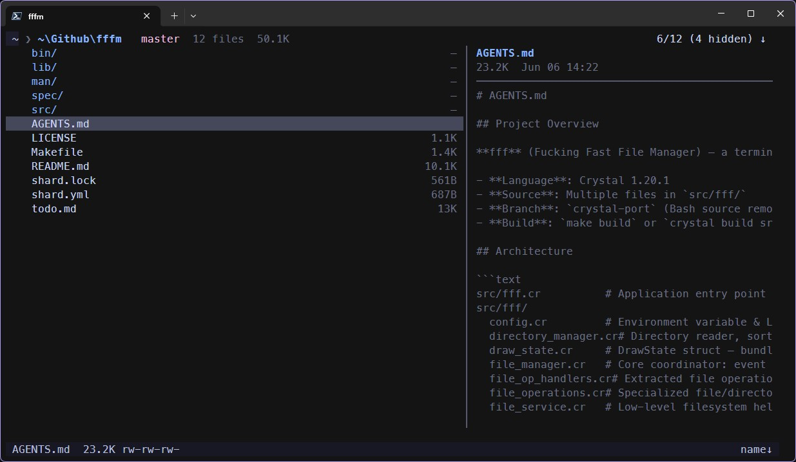

# fff.cr — Fucking Fast File Manager

[](https://crystal-lang.org)
[](LICENSE)



A terminal-based file manager written in **Crystal**. Ported from the original Bash version for performance, safety, and maintainability.

## Features

- **Fast**: `LS_COLORS` caching, optimized incremental render loop, no flicker
- **Modern Themes**: Truecolor RGB central theme system with 5 built-in presets (`default`, `catppuccin-mocha`, `gruvbox-dark`, `nord`, `dracula`).
- **Nerd Font Icons**: Support for file and directory icons using Nerd Fonts (over 100+ extensions and 35+ special file mapping).
- **Dual-Pane View (Preview Panel)**: Interactive directory and file content preview side panel (automatically adapts when terminal columns >= 80).
- **Details Columns**: Shows file size and modification time directly in the file list.
- **Toast Notifications**: Interactive notification system (Error, Success, Warning, Info) with custom colors and icons, featuring auto-expiry.
- **Navigable Search**: Fuzzy filename filtering, ripgrep content search (`!` prefix), and recursive directory tree search (`>` prefix) while keeping cursor navigation live.
- **Progress Bars**: Interactive progress bar for bulk operations (copying/deleting 5+ files).
- **Inline Prompts & Confirms**: Inputs (new file, new dir, rename, go-to-dir) and confirmations (delete, executable toggle) stay inside the TUI.
- **File Operations**: Copy, move, delete (trash), rename, bulk rename, symlink with auto-advance navigation.
- **Smart Full Preview**: Full-screen preview via `bat` → `less` → built-in fallback chain; file attributes via `File::Info`/`stat`
- **Picker Mode**: `-p` flag writes selection to `~/.cache/fff/opened_file` for external tool integration
- **Secure**: All external commands via `Process.run` (no shell injection), pre-operation writability checks
- **Customizable**: Full keybinding, theme, and layout control via environment variables or `~/.config/fff/config.json`

## Installation

### Requirements

- Crystal 1.20.1+
- Windows 11, Linux, or macOS terminal (with true-color support recommended)

### Build

**On Linux/macOS:**

```bash
make deps       # install shards
make build      # release build → bin/fff-cr
make debug      # debug build (faster compile)
make run        # build + run
make test       # run test suite

# Optional: system-wide install (including man page)
sudo make install
```

**On Windows 11 (PowerShell):**

```powershell
shards install                              # install shards
crystal build src/fff.cr -o bin/fff-cr.exe  # build fff-cr.exe
crystal spec spec/fff/                      # run unit tests
.\bin\fff-cr.exe                            # run the app
```

## Usage

```bash
fff-cr                    # open current directory
fff-cr /path/to/dir       # open specific directory
fff-cr -p                 # picker mode (writes to opened_file cache)
```

### Key Bindings

| Key | Action | Key | Action |
| --- | --- | --- | --- |
| `j`/`k` | Down/Up | `l`/`h` | Enter/Parent |
| `q` | Quit | `?` | Help overlay |
| `/` | Search (Navigable) | `space` | Mark |
| `m` | Mark all | `y`/`v` | Copy/Cut |
| `p` | Paste | `d` | Delete (trash) |
| `t` | Go to trash | `n` | New dir |
| `f` | New file | `r` | Rename |
| `b` | Bulk rename | `i` | Preview |
| `x` | Attributes | `X` | Toggle executable |
| `s` | Spawn shell | `g`/`G` | Top/Bottom |
| `↑`/`↓` | Cursor | `PgUp`/`PgDn` | Page up/down |
| `.` | Toggle hidden | `~` | Home |
| `-` | Previous dir | `e` | Refresh |
| `=` / `+` | Cycle sort / Reverse | `:` | Go to dir |
| `S` | Symlink | `1-9` | Favorites |

In search and rename modes, `←`/`→` move within the input text, `Backspace`/`Delete` edit, `Home`/`End` jump to start/end.

All bindings are configurable via `FFF_KEY_*` environment variables.

### Search Engine Prefixes

When in search mode (triggered by `/`), you can prefix your query to activate different search modes:

| Prefix | Mode | Description |
| --- | --- | --- |
| (none) | **Fuzzy Filename** | Fuzzy matches filenames within the current directory. |
| `!` | **Content Search** | Calls `rg` (ripgrep) to search file content (requires pressing Enter to search). |
| `>` | **Recursive Search** | Recursively fuzzy searches files in the directory tree (up to 5 levels deep, capped at 200 results). |

## Configuration

fff reads from environment variables first, then falls back to `~/.config/fff/config.json`.

### UI & Layout Settings

| Env Variable | Config JSON Key | Description / Values |
| --- | --- | --- |
| `FFF_THEME` | `theme` | UI Theme: `default`, `catppuccin-mocha`, `gruvbox-dark`, `nord`, `dracula` (Default: `default`) |
| `FFF_ICONS` | `icons` | Enable Nerd Font icons: `1` or `true` (Default: disabled) |
| `FFF_COLUMNS` | `show_columns` | Show details columns (size/date): `1` or `true` (Default: enabled) |
| `FFF_COLUMN_MODE` | `column_mode` | Column display mode: `size`, `date`, or `both` (Default: `both`) |
| `FFF_PREVIEW` | `preview` | Enable directory/file preview side-panel when term is wide enough: `1` or `true` (Default: disabled) |

### Key variables

```bash
export FFF_OPENER="xdg-open"              # file opener
export FFF_FAV1="$HOME/Documents"         # favorite dirs 1-9
export FFF_CD_ON_EXIT="1"                 # save cwd on exit
export FFF_TRASH="$HOME/.local/share/fff/trash"

# Example UI settings:
export FFF_THEME="catppuccin-mocha"
export FFF_ICONS="1"
export FFF_PREVIEW="1"
```

Full list of `FFF_KEY_*` variables: `UP`, `DOWN`, `ENTER`, `QUIT`, `SEARCH`, `PARENT`, `MARK`, `MARK_ALL`, `COPY`, `MOVE`, `PASTE`, `DELETE`, `NEW_DIR`, `MKFILE`, `RENAME`, `BULK_RENAME`, `PREVIEW`, `SHELL`, `HIDDEN`, `HOME`, `PREVIOUS`, `REFRESH`, `ATTRIBUTES`, `EXECUTABLE`, `GO_DIR`, `GO_TRASH`, `SYMLINK`, `TOP`, `BOTTOM`, `PAGE_UP`, `PAGE_DOWN`.

```json
{
  "editor": "vim",
  "opener": "xdg-open",
  "trash_dir": "/path/to/trash",
  "theme": "catppuccin-mocha",
  "icons": true,
  "show_columns": true,
  "column_mode": "both",
  "preview": true,
  "favorites": { "1": "/home/user/Documents" },
  "keys": { "up": "k", "down": "j" },
  "bookmarks": { "proj": "/home/user/projects" }
}
```

## Preview

Press `i` to preview a file. The preview chain tries:

1. `bat --paging=always` — syntax-highlighted, scrollable
2. `less` — paged, searchable
3. Built-in — plain text with full scroll support

Directories always use the built-in preview.

## Project Structure

```text
.
├── bin/fff-cr               # compiled binary
├── man/fff-cr.1             # man page
├── src/
│   ├── fff.cr               # entry point
│   └── fff/
│       ├── config.cr
│       ├── directory_manager.cr
│       ├── draw_state.cr
│       ├── file_manager.cr
│       ├── file_op_handlers.cr
│       ├── file_operations.cr
│       ├── file_service.cr
│       ├── format_utils.cr
│       ├── icon_provider.cr
│       ├── input_mode.cr
│       ├── message_bus.cr
│       ├── navigation_handlers.cr
│       ├── preview_panel.cr
│       ├── progress_bar.cr
│       ├── search_engine.cr
│       ├── terminal.cr
│       ├── theme.cr
│       ├── ui_renderer.cr
│       └── view_handlers.cr
├── spec/                    # test suite
│   ├── spec_helper.cr
│   ├── fff/
│   └── integration/
├── Makefile
├── shard.yml
├── .ameba.yml               # linter config
└── LICENSE
```

## Architecture

- **FFF::Application** — CLI argument parsing, terminal setup
- **FFF::Config** — env var & JSON config management, `LS_COLORS` parsing, layout preferences
- **FFF::DirectoryManager** — directory reading, sorting, hidden-file filtering
- **FFF::DrawState** — bundles all redraw parameters into one struct
- **FFF::FileManager** — event loop, hash-table key dispatch, and TUI router; includes `NavigationHandlers`, `FileOpHandlers`, `ViewHandlers`
- **FFF::FileOperations** — file/directory creation, deletion, copying with callback blocks for progress tracking
- **FFF::FileService** — low-level `copy`/`move`/`trash`/`symlink` with writability checks
- **FFF::FormatUtils** — shared helpers (`human_size`, date formatting), `FFF::HOME` constant
- **FFF::IconProvider** — maps file extensions and special names to Nerd Font icons
- **FFF::InputMode** — search/rename text input with cursor control, editing, and search mode matching
- **FFF::MessageBus** — thread-safe TUI toast notification queue (Error/Success/Warning/Info)
- **FFF::PreviewPanel** — split pane displaying file previews/details and directory entries
- **FFF::ProgressBar** — ANSI progress bar tracking bulk operations
- **FFF::SearchEngine** — fuzzy filename matching, ripgrep content search, and recursive tree search
- **FFF::Terminal** — `crystal-term` shard wrapper
- **FFF::Theme** — truecolor RGB color palette system with pre-configured styles
- **FFF::UIRenderer** — incremental, flicker-free drawing, truecolor CSS/TUI styling, layout composition

## Development

```bash
make test       # run all specs
make format     # crystal tool format
make lint       # ameba static analysis
```

### Running Tests

```bash
make test           # all specs
crystal spec spec/integration/navigation_integration_spec.cr
crystal spec spec/integration/advanced_integration_spec.cr
```

#### Test Architecture

- **93 unit tests** across 6 modules (config, directory_manager, file_service, input_mode, search_engine, ui_renderer)
- **43 integration tests** across 2 suites (navigation + advanced) — use `MockTerminal` to simulate keyboard input and prompts without a real TTY

- Both specs run headless; no terminal or display required

### Patches

The project patches several `crystal-term` shard bugs in `lib/` after `shards install`. See `AGENTS.md` for details.

## License

MIT. See [LICENSE](LICENSE).
